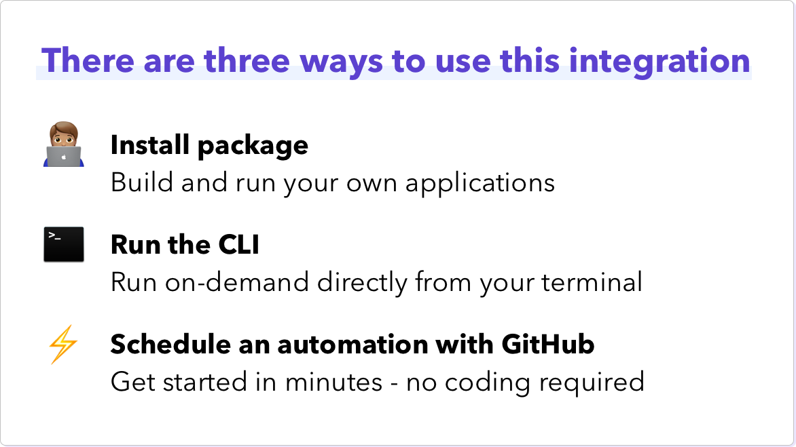

# Notion Interactions to Orbit Workspace


[](https://badge.fury.io/rb/notion_orbit)
[](.github/CODE_OF_CONDUCT.md)

Add your Notion interactions into your Orbit workspace with this community-built integration.

| <p align="left">:sparkles:</p> This is a _community project_. The Orbit team does its best to maintain it and keep it up to date with any recent API changes.<br/><br/>We welcome community contributions to make sure that it stays current. <p align="right">:sparkles:</p> |
| ----------------------------------------------------------------------------------------------------------------------------------------------------------------------------------------------------------------------------------------------------------------------------- |



## First Time Setup

To set up this integration you will need some details from Notion. To get these details please follow the [First Time Setup guide](docs/setup.md).

## Application Credentials

The application requires the following environment variables:

| Variable                | Description                 | More Info                                                                                                  |
| ----------------------- | --------------------------- | ---------------------------------------------------------------------------------------------------------- |
| `NOTION_API_KEY`        | The secret Notion API key   | Follow the [First Time Setup Guide](docs/setup.md) for instructions on finding the API key                                                                                            |
| `NOTION_WORKSPACE_SLUG` | Your Notion workspace name           | If your website address is `https://notion.so/my-workspace/` then your slug is `my-workspace`                                                                                            |
| `NOTION_DATABASE_ID`    | The ID of the Notion database this integration is tracking           | Your database ID the part of your Notion database URL that follows after your workspace slug and before the question mark (`?`). The ID is 32 characters long, containing numbers and letters.                                                                                             |
| `ORBIT_API_KEY`         | API key for Orbit           | Found in `Account Settings` in your Orbit workspace                                                        |
| `ORBIT_WORKSPACE_ID`    | ID for your Orbit workspace | Last part of the Orbit workspace URL, i.e. `https://app.orbit.love/my-workspace`, the ID is `my-workspace` |

## Package Usage

Install the package with the following command

```
$ gem install notion_orbit
```

Then, run `bundle install` from your terminal.

You can instantiate a client by either passing in the required credentials during instantiation or by providing them in your `.env` file.

### Instantiation with credentials:

```ruby
client = NotionOrbit::Client.new(
    orbit_api_key: YOUR_API_KEY,
    orbit_workspace_id: YOUR_ORBIT_WORKSPACE_ID,
    notion_api_key: YOUR_NOTION_API_KEY,
    notion_database_id: YOUR_NOTION_DATABASE_ID,
    notion_workspace_slug: YOUR_NOTION_WORKSPACE_SLUG
)
```

### Instantiation with credentials in dotenv file:

```ruby
client = NotionOrbit::Client.new
```

### Fetching New Notes 

Once, you have an instantiated client, you can fetch new notes and add them to your Orbit workspace by invoking the `#notes` method on the client:

```ruby
client.notes
```

## CLI Usage

You can also use this package with the included CLI. To use the CLI pass in the required environment variables on the command line before invoking the CLI.

To check for new event RSVPs:

```bash
$ ORBIT_API_KEY=... ORBIT_WORKSPACE_ID=... NOTION_API_KEY=... NOTION_DATABASE_ID=... NOTION_WORKSPACE_SLUG=... bundle exec notion_orbit --check-notes
```

## GitHub Actions Automation Setup

⚡ You can set up this integration in a matter of minutes using our GitHub Actions template. It will run regularly to add new activities to your Orbit workspace. All you need is a GitHub account.

[See our guide for setting up this automation](https://github.com/orbit-love/github-actions-templates/blob/main/Notion/README.md)

## Contributing

We 💜 contributions from everyone! Check out the [Contributing Guidelines](.github/CONTRIBUTING.md) for more information.

## License

This project is under the [MIT License](./LICENSE).

## Code of Conduct

This project uses the [Contributor Code of Conduct](.github/CODE_OF_CONDUCT.md). We ask everyone to please adhere by its guidelines.
